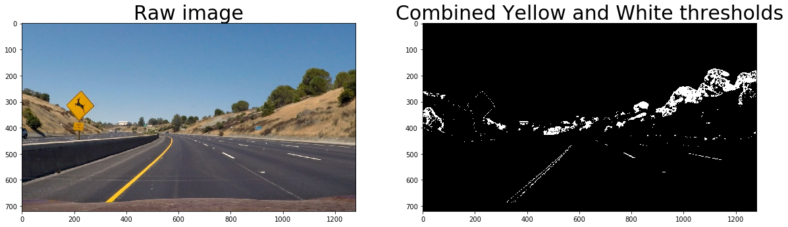
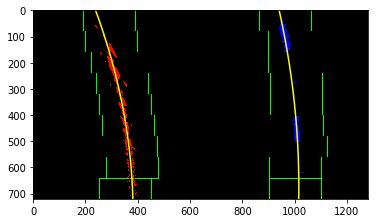
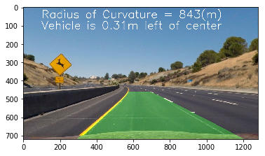

## **Advanced Lane Finding Project**
[](http://www.udacity.com/drive)

In this project, I write a software pipeline to identify the lane boundaries in a video.

The goals / steps of this project are the following:

* Compute the camera calibration matrix and distortion coefficients given a set of chessboard images.
* Apply a distortion correction to raw images.
* Use color transforms, gradients, etc., to create a thresholded binary image.
* Apply a perspective transform to rectify binary image ("birds-eye view").
* Detect lane pixels and fit to find the lane boundary.
* Determine the curvature of the lane and vehicle position with respect to center.
* Warp the detected lane boundaries back onto the original image.
* Output visual display of the lane boundaries and numerical estimation of lane curvature and vehicle position.

### [Rubric](https://review.udacity.com/#!/rubrics/571/view) Points

Here I will consider the rubric points individually and describe how I addressed each point in my implementation.  


### Camera Calibration

#### 1. Briefly state how you computed the camera matrix and distortion coefficients. Provide an example of a distortion corrected calibration image.

The code for this step is contained in the first code cell of `pipeline_image.ipynb`.  

I start by preparing "object points", which will be the (x, y, z) coordinates of the chessboard corners in the world. Here I am assuming the chessboard is fixed on the (x, y) plane at `z=0`c, such that the object points are the same for each calibration image.  Thus, `objp` is just a replicated array of coordinates, and `objpoints` will be appended with a copy of it every time I successfully detect all chessboard corners in a test image.  `imgpoints` will be appended with the (x, y) pixel position of each of the corners in the image plane with each successful chessboard detection.  

I then used the output `objpoints` and `imgpoints` to compute the camera calibration and distortion coefficients using the `cv2.calibrateCamera()` function.  I applied this distortion correction to the test image using the `cv2.undistort()` function and obtained this result:


### Pipeline (single image)

#### 1. Provide an example of a distortion-corrected image.

To demonstrate this step, I will describe how I apply the distortion correction to one of the test images like this one:


#### 2. Describe how (and identify where in your code) you used color transforms, gradients or other methods to create a thresholded binary image.  Provide an example of a binary image result.

I used a combination of white color threshold and  yellow color threshold to generate a binary image (thresholding steps in the 4th code cell of `pipeline_image.ipynb`).  Here's an example of my output for this step.



#### 3. Describe how (and identify where in your code) you performed a perspective transform and provide an example of a transformed image.

The code for my perspective transform is in the 5th cell of `pipeline_image.ipynb`. I chose the hardcode the source and destination points in the following manner:

```python
src = np.float32(
    [[(img_size[0] / 2) - 55, img_size[1] / 2 + 100],
    [((img_size[0] / 6) - 10), img_size[1]],
    [(img_size[0] * 5 / 6) + 60, img_size[1]],
    [(img_size[0] / 2 + 55), img_size[1] / 2 + 100]])

dst = np.float32(
    [[320, 0],
     [320, 720],
     [960, 720],
     [960, 0]])
```

This resulted in the following source and destination points:

| Source        | Destination   |
|:-------------:|:-------------:|
| 585, 460      | 320, 0        |
| 203, 720      | 320, 720      |
| 1127, 720     | 960, 720      |
| 695, 460      | 960, 0        |

I verified that my perspective transform was working as expected by drawing the `src` and `dst` points onto a test image and its warped counterpart to verify that the lines appear parallel in the warped image.

#### 4. Describe how (and identify where in your code) you identified lane-line pixels and fit their positions with a polynomial?

The histogram in the output of cell #6 of `pipeline_image.ipynb` clearly shows the left and right lane lines. I fit my lane lines with a 2nd order polynomial. I also used sliding window to track the lanes.



#### 5. Describe how (and identify where in your code) you calculated the radius of curvature of the lane and the position of the vehicle with respect to center.

I did this in cell #12 of `pipeline_image.ipynb`. For radius of curvature, it's the average of `left_curverad` and `right_curverad`. For position of the vehicle with respect to center, it's the difference between the supposed middle point(x=640) and the true middle point in the image. Of course, I had to map the value from pixel to real world.

#### 6. Provide an example image of your result plotted back down onto the road such that the lane area is identified clearly.

I implemented this step in cell #11 and #12 of `pipeline_image.ipynb`.  Here is an example of my result on a test image:



---

### Pipeline (video)

#### 1. Provide a link to your final video output.  Your pipeline should perform reasonably well on the entire project video (wobbly lines are ok but no catastrophic failures that would cause the car to drive off the road!).

I built a pipeline to generate video in a different notebook: `pipeline_video.ipynb` cause I need to reuse the code to process each single frame of the video.

Here's a [link to my video result](https://github.com/leros/Self-Driving-Car-Advanced-Lane-Finding/blob/master/project_video_processed.mp4)

---

### Discussion

#### 1. Briefly discuss any problems / issues you faced in your implementation of this project.  Where will your pipeline likely fail?  What could you do to make it more robust?

In this project, I built a pipeline with cv2 to calibrate camera and process image. Some key information are added to the processed image: lane lines, radius of curvature, and position respect to center.  Two issues may hurt the model's ability to find lane lines.

1. The source points(src) and destination points(dst) used for transforming perspective were hardcoded. We may have a situation where the src and dst are not working well and the warped image is bad. Therefore, a better method to identify those points are needed.
2. Some objects on the image like the fence along the road might be recognized by the model as lane line. I may tune the model by trying out different color channels.
